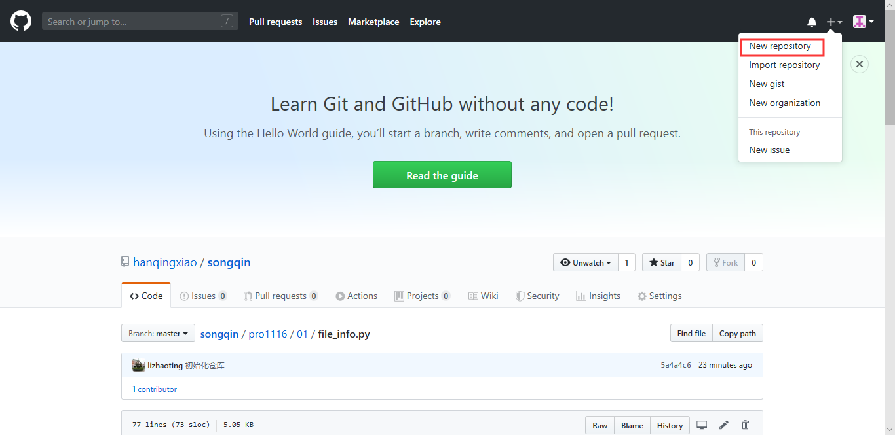
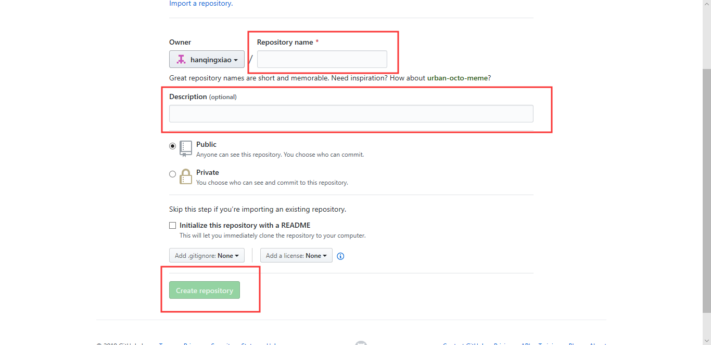
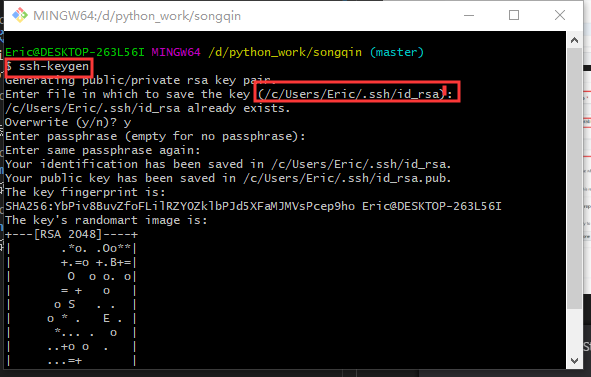
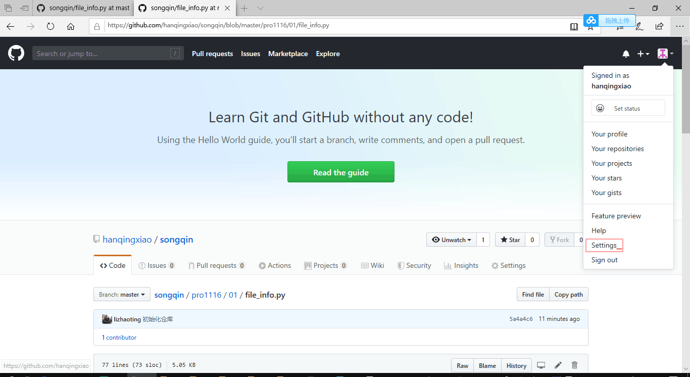
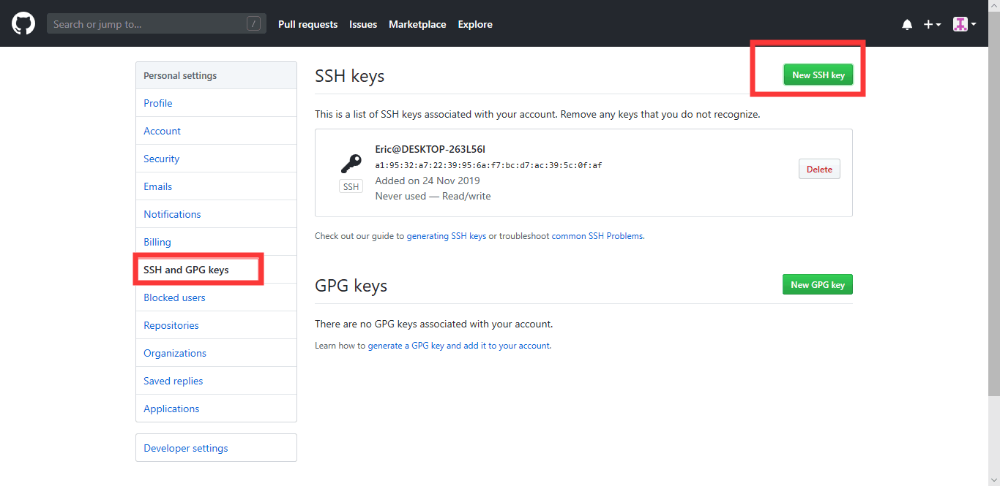

<<<<<<< Updated upstream
下载gitbash 
安装成功后查看~/.shh
进入后ssh-keygen -t rsa -C "2036244560@qq.com" 生成密钥   路径原地保存，密码123456
id_rsa.pub 文件为密钥 复制

登录网页GitHub ，工具->setting->key ->add

在本地创建git库   git init

git clone git@github.com:hanqingxiao/songqin.git   -将GitHub克隆到本地电脑

git add .
git commit -m "waichanglianxi"
git push
=======
# github创建项目

# 设置秘钥
#### ssk-keygen ---设置秘钥

# 获取和提交代码
 git clone git@github.com:hanqingxiao/songqin.git
---获取github仓库代码
#### git add .
--将本地代码添加到github
#### git commit -m ""
---提交本地代码并写说明
#### git push
---推送本地代码

>>>>>>> Stashed changes
